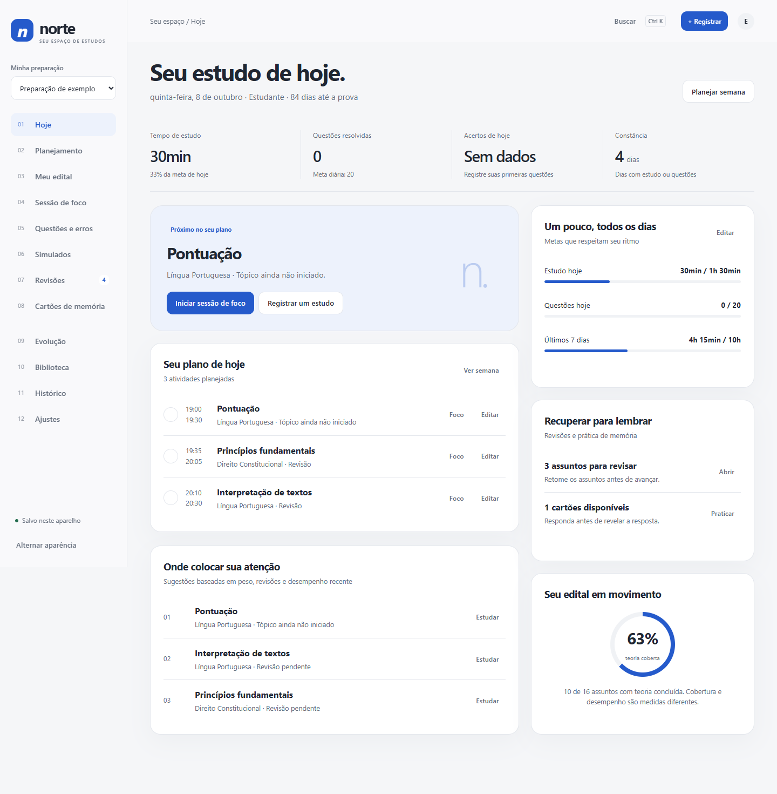
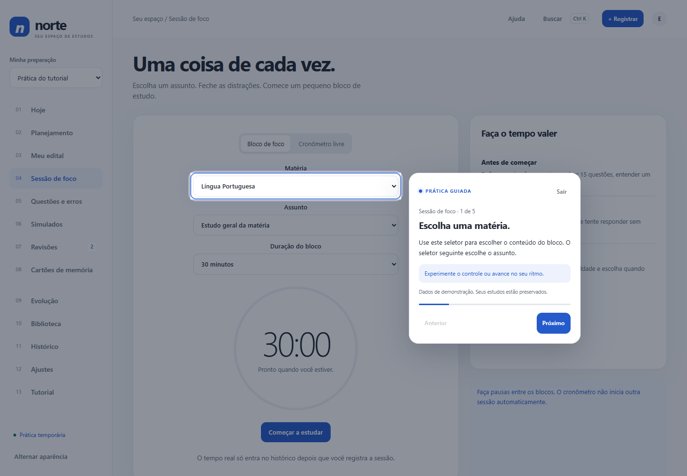
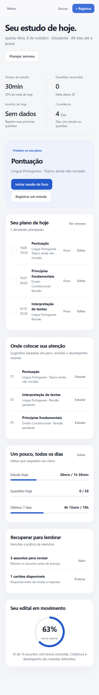

# Norte — Seu espaço de estudos

Um painel pessoal para organizar sua preparação, planejamento, foco, questões e revisões.

**[Abrir o site](https://joaovitorgoncalvesdev.github.io/norte-estudos/)** · **[Guia de uso](docs/guia.md)**



## Funcionalidades

- Tutorial ao vivo com 95 passos em 14 áreas, com controles destacados, cliques guiados e progresso salvo.
- Favicon com a marca Norte, incluído no HTML para uso offline.
- Visão do dia com metas, tarefas e revisões.
- Planejamento conforme disponibilidade, prioridades e desempenho.
- Organização do edital por disciplinas e assuntos.
- Sessões de foco com alarme ao terminar, lembrete por minutos, teste de som e registro de estudo.
- Minipainel arrastável entre telas e janela sempre visível com Document Picture-in-Picture em navegadores compatíveis.
- Questões, caderno de erros e simulados.
- Revisões espaçadas e cartões de memória.
- Evolução, biblioteca e histórico.
- Múltiplas preparações, busca e aparência clara ou escura.
- Backup em JSON, importação e exportação de registros em CSV.
- Interface adaptada a computadores e celulares.

## Aprender na prática

Use **Tutorial** no menu para escolher uma área ou iniciar o tour completo. O botão **Ajuda** abre o tour da tela atual. A prática usa uma preparação temporária: cadastros, cronômetro e registros de demonstração são descartados ao sair, sem alterar seus estudos reais. Você pode avançar, voltar, pular passos e retomar depois.



## Usar no computador

Baixe o projeto e abra `index.html` no navegador. O painel de estudos funciona offline, sem instalar dependências. O assistente de IA precisa de internet e da versão publicada no GitHub Pages.

## Dados de estudo

Os registros são salvos no armazenamento local do navegador (`norte.study.v1`). Cada navegador e aparelho tem seus próprios dados. Use o backup em **Ajustes** para transferir a preparação ou protegê-la antes de limpar os dados do navegador. O aplicativo não sincroniza dados entre aparelhos e não envia seus registros para um servidor.

## Desenvolver

O painel usa HTML, CSS e JavaScript nativos. O assistente carrega a verificação Turnstile somente após autorização do envio. Para alterar o aplicativo, edite os arquivos de `src/`. Com Node.js instalado, execute:

```sh
npm run check
npm run build
```

O comando de build gera o `index.html` completo. Não é necessário executar `npm install`.

```text
index.html                 Aplicativo completo, pronto para abrir ou hospedar
src/index.template.html    Estrutura da página
src/styles.css             Estilos e responsividade
src/app.js                 Interface e regras de estudo
scripts/build.mjs          Geração do HTML completo
favicon.svg                Ícone da marca
docs/                      Guia e imagens
```

## Hospedar

Publique o `index.html` em uma hospedagem de sites estáticos. O aplicativo não precisa de servidor de aplicação, banco de dados ou chave de API. Ao mudar de endereço, exporte seus dados no site antigo e importe no novo, pois o armazenamento do navegador é separado por endereço.

## Prévia no celular



## NORBIT AI

O Norte oferece explicações, cartões editáveis e questões de treino com NORBIT AI. Você pode escolher de 1 a 10 questões, a dificuldade e usar o contexto da preparação ativa. O painel continua salvando no navegador; a IA é opcional, requer internet e envia o conteúdo escolhido e, se ativado e autorizado, um resumo da preparação. Chaves ficam no Cloudflare, nunca no GitHub. Veja [configuração e uso](docs/ia.md).


## Mascote NORBIT

Um companheiro minimalista com movimentos suaves de boas-vindas, espera, acerto, incentivo, foco e pausa. As animações respeitam movimento reduzido. [Assistir ao vídeo do mascote](assets/norbit.mp4).

A criação guiada de perfis foi retirada. Novas preparações usam o formulário simples; os estudos existentes continuam preservados.


## Conversas salvas e cartões com movimento
Na NORBIT AI, cada primeira mensagem abre uma conversa por assunto. Use Conversas no celular ou a lista lateral no computador para buscar e reabrir um chat. Você pode renomear, excluir e desfazer a exclusão. Os chats ficam neste navegador, separados por preparação, e entram no backup exportado; não são sincronizados entre aparelhos.

Responda normalmente às perguntas do tutor: o histórico recente é enviado com a nova mensagem, mantendo o assunto. Até 12 mensagens recentes, com limite de tamanho, são usadas como contexto; detalhes antigos de chats muito longos podem ficar de fora. Confira as respostas no seu material.

Não há caixa de autorização: clicar em Enviar autoriza o envio da mensagem e do histórico recente daquele chat. O resumo da preparação continua opcional. A verificação humana só aparece quando você pede uma resposta, e o envio segue automaticamente depois que ela termina. Você pode cancelar enquanto verifica. As cotas existentes continuam valendo.

Nos flashcards, clique ou use espaço para virar. O movimento pode ser invertido antes de terminar, e a próxima pergunta entra suavemente. Com movimento reduzido, a troca é estática. A avaliação e os intervalos de revisão continuam iguais.
